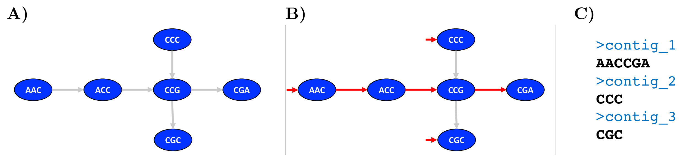
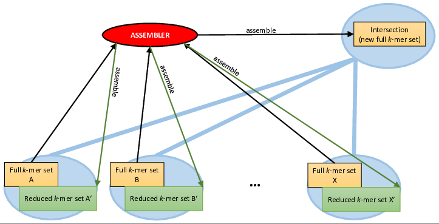

# ProphAsm

[](https://travis-ci.org/prophyle/prophasm)


## Prerequisities

* GCC 4.8+ or equivalent
* ZLib


## Getting started

```
git clone https://github.com/prophyle/prophasm
cd prophasm && make -j
./prophasm -k 15 -i tests/test1.fa -i tests/test2.fa -o _out1.fa -o _out2.fa -x _intersect.fa -s _stats.tsv
```

## Command line parameters

<!---
USAGE-BEGIN
-->
```
Program:  prophasm (a greedy assembler for k-mer set compression)
Version:  0.1.0
Contact:  Karel Brinda <kbrinda@hsph.harvard.edu>

Usage:    prophasm [options]

Examples: prophasm -k 15 -i f1.fa -i f2.fa -x fx.fa
             - compute intersection of f1 and f2
          prophasm -k 15 -i f1.fa -i f2.fa -x fx.fa -o g1.fa -o g2.fa
             - compute intersection of f1 and f2, and subtract it from them
          prophasm -k 15 -i f1.fa -o g1.fa
             - re-assemble f1 to g1

Command-line parameters:
 -k INT   K-mer size.
 -i FILE  Input FASTA file (can be used multiple times).
 -o FILE  Output FASTA file (if used, must be used as many times as -i).
 -x FILE  Compute intersection, subtract it, save it.
 -s FILE  Output file with k-mer statistics.
 -S       Silent mode.

Note that '-' can be used for standard input/output.

```
<!---
USAGE-END
-->

## Algorithm





## Issues

Please use [Github issues](https://github.com/prophyle/prophasm/issues).


## Changelog

See [Releases](https://github.com/prophyle/prophasm/releases).


## Licence

[MIT](https://github.com/prophyle/prophasm/blob/master/LICENSE)


## Author

Karel Brinda \<kbrinda@hsph.harvard.edu\>
